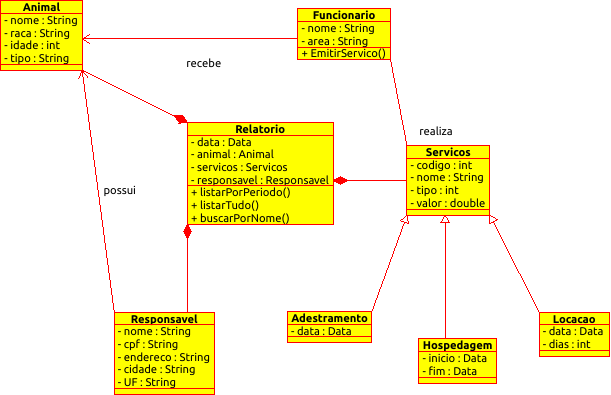

# SystemCanyl
<<<<<<< HEAD
O projeto será voltado para o controle  e gerenciador de serviços de um Canil e Gatil.  As principais funcionalidades do sistema serão  garantir  a automação dos procedimentos realizados no estabelecimento como,  adestramento, hospedagem e locação dos animais.

__Diagrama UML__

=======
O projeto será voltado para o controle  e gerenciameto de serviços de um Canil e Gatil.  As principais funcionalidades do sistema serão  garantir  a automação dos procedimentos realizados no estabelecimento como,  adestramento, hospedagem e locação dos animais.
>>>>>>> 088305394b44307c5e58abfbc9df25fe250ea74d
